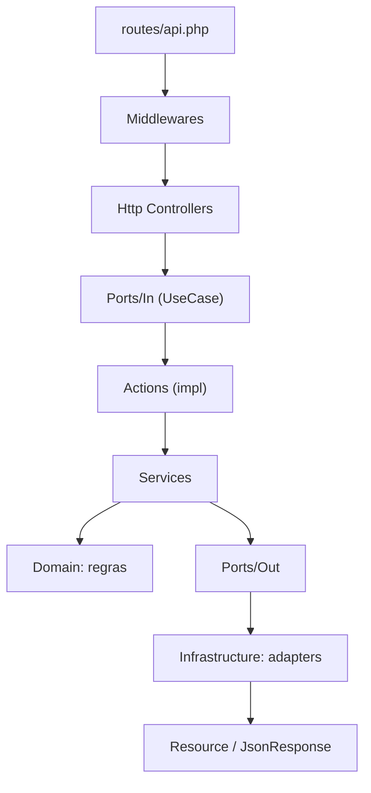
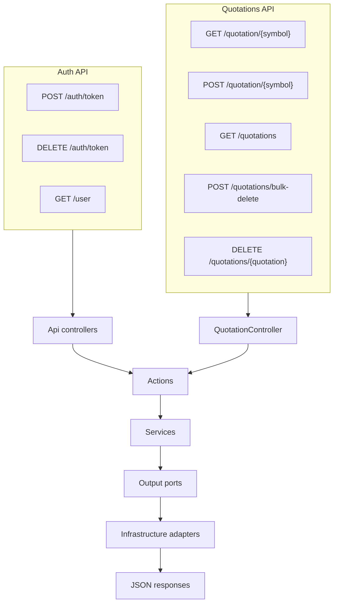
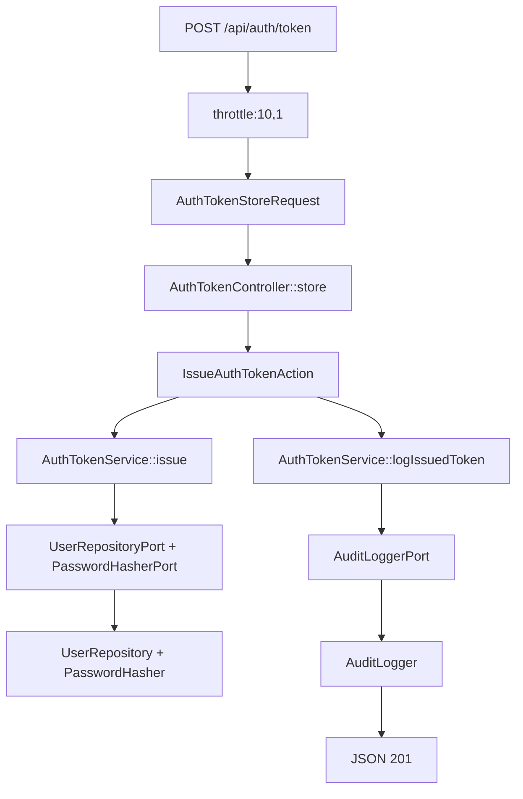
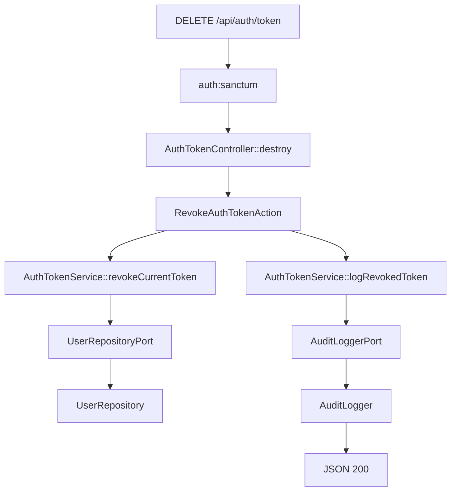
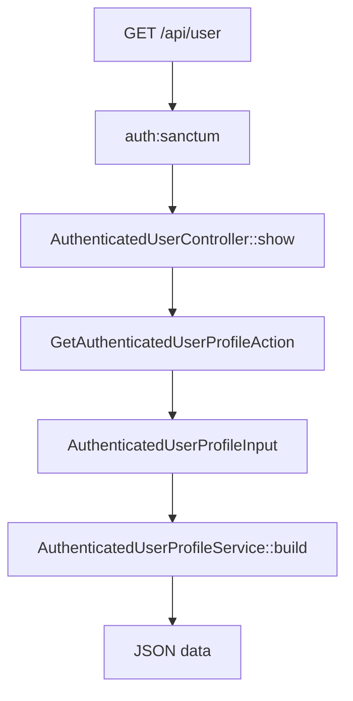
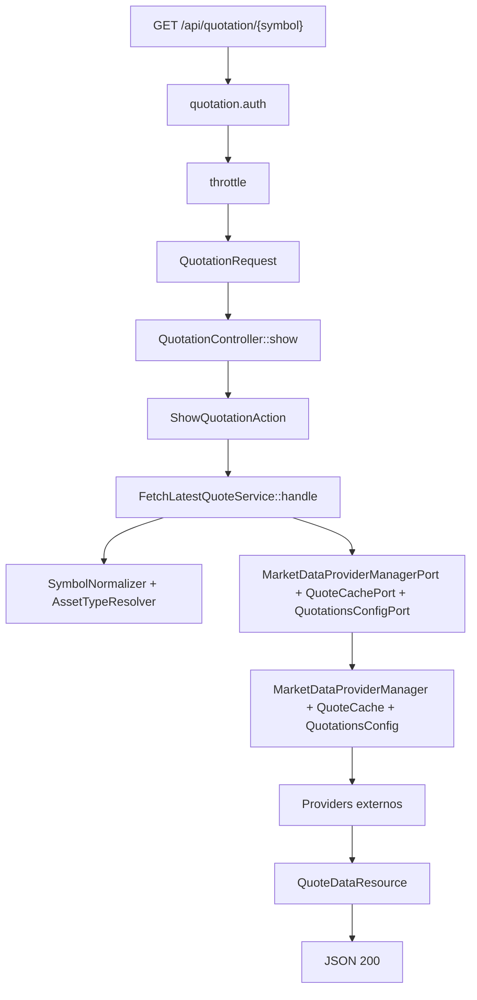
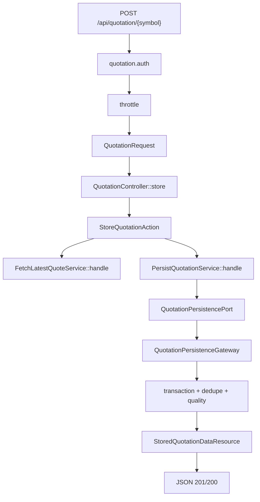
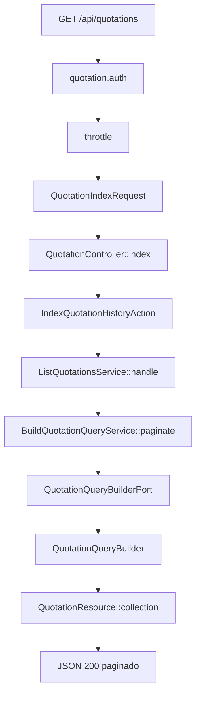
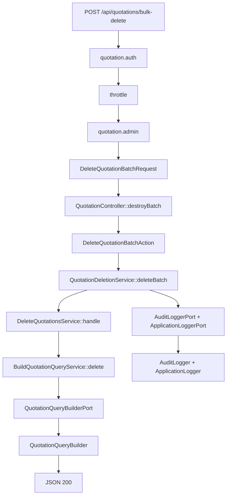
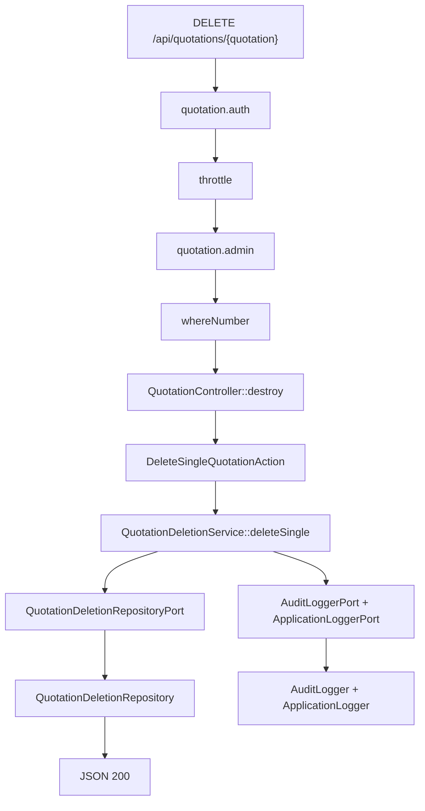

# Mapa de Fluxo da API

Objetivo: documentar o fluxo de execucao de todas as rotas de `routes/api.php` com classes reais por camada.
Hub principal: [`README.md`](README.md).

## Como ler esta pagina

1. Use a secao "Visao executiva" para entender o desenho geral.
2. Use a secao "Fluxos detalhados" para abrir apenas o endpoint que voce quer estudar.
3. Em cada endpoint, leia na ordem: middleware -> controller -> action -> service -> ports -> adapters -> resposta.

## Cobertura

1. Escopo: somente rotas de `routes/api.php`.
2. Total de endpoints mapeados: `8`.
3. Modelo de camadas: `Http -> Ports/In -> Actions -> Services -> Domain -> Ports/Out -> Infrastructure`.

## Inventario de endpoints

| Grupo | Endpoint | Controller | Action principal | Service principal |
| --- | --- | --- | --- | --- |
| Auth | `POST /api/auth/token` | `AuthTokenController@store` | `IssueAuthTokenAction` | `AuthTokenService` |
| Auth | `DELETE /api/auth/token` | `AuthTokenController@destroy` | `RevokeAuthTokenAction` | `AuthTokenService` |
| Auth | `GET /api/user` | `AuthenticatedUserController@show` | `GetAuthenticatedUserProfileAction` | `AuthenticatedUserProfileService` |
| Quotations | `GET /api/quotation/{symbol}` | `QuotationController@show` | `ShowQuotationAction` | `FetchLatestQuoteService` |
| Quotations | `POST /api/quotation/{symbol}` | `QuotationController@store` | `StoreQuotationAction` | `PersistQuotationService` |
| Quotations | `GET /api/quotations` | `QuotationController@index` | `IndexQuotationHistoryAction` | `ListQuotationsService` |
| Quotations | `POST /api/quotations/bulk-delete` | `QuotationController@destroyBatch` | `DeleteQuotationBatchAction` | `QuotationDeletionService` |
| Quotations | `DELETE /api/quotations/{quotation}` | `QuotationController@destroy` | `DeleteSingleQuotationAction` | `QuotationDeletionService` |

## Visao executiva

### Camadas

### Macrofluxo por dominio

## Fluxos detalhados (expandir)

<code>POST /api/auth/token</code>

Middlewares:
1. `throttle:10,1`

<code>DELETE /api/auth/token</code>

Middlewares:
1. `auth:sanctum`

<code>GET /api/user</code>

Middlewares:
1. `auth:sanctum`

<code>GET /api/quotation/{symbol}</code>

Middlewares:
1. `quotation.auth`
2. `throttle:config(quotations.rate_limit)`

<code>POST /api/quotation/{symbol}</code>

Middlewares:
1. `quotation.auth`
2. `throttle:config(quotations.rate_limit)`

<code>GET /api/quotations</code>

Middlewares:
1. `quotation.auth`
2. `throttle:config(quotations.rate_limit)`

<code>POST /api/quotations/bulk-delete</code>

Middlewares:
1. `quotation.auth`
2. `throttle:config(quotations.rate_limit)`
3. `quotation.admin`

<code>DELETE /api/quotations/{quotation}</code>

Middlewares:
1. `quotation.auth`
2. `throttle:config(quotations.rate_limit)`
3. `quotation.admin`
4. `whereNumber(quotation)`

## Regras transversais

1. Middleware global de correlacao: `AssignRequestId` em `bootstrap/app.php` e `app/Http/Middleware/AssignRequestId.php`.
2. Alias `quotation.auth` em `bootstrap/app.php`, implementado por `app/Http/Middleware/EnsureQuotationApiAuthentication.php`.
3. Alias `quotation.admin` em `bootstrap/app.php`, implementado por `app/Http/Middleware/EnsureQuotationAdminAuthorization.php`.
4. Alias `gateway.only` em `bootstrap/app.php`, implementado por `app/Http/Middleware/EnsureRequestFromGateway.php`.
5. Chave de auth condicional para cotacoes: `config/quotations.php` (`QUOTATIONS_REQUIRE_AUTH`).
6. Tratamento padronizado de erros da API: `bootstrap/app.php` (`message`, `error_code`, `request_id`).

## Ports e adapters usados por estas rotas

| Port (Application/Ports/Out) | Adapter (Infrastructure) | Uso principal |
| --- | --- | --- |
| `UserRepositoryPort` | `UserRepository` | emissao/revogacao de token |
| `PasswordHasherPort` | `PasswordHasher` | validacao de credenciais |
| `AuditLoggerPort` | `AuditLogger` | trilha de auditoria |
| `ApplicationLoggerPort` | `ApplicationLogger` | logs de aplicacao |
| `MarketDataProviderManagerPort` | `MarketDataProviderManager` | ordem de fallback de provider |
| `QuoteCachePort` | `QuoteCache` | cache de cotacoes |
| `QuotationsConfigPort` | `QuotationsConfig` | configuracoes de cotacoes |
| `QuotationPersistencePort` | `QuotationPersistenceGateway` | persistencia de cotacoes |
| `QuotationQueryBuilderPort` | `QuotationQueryBuilder` | listagem e delete em lote |
| `QuotationDeletionRepositoryPort` | `QuotationDeletionRepository` | delete unitario |

Bindings centralizados em `app/Providers/AppServiceProvider.php`.

## Relacao com outros documentos

1. Contrato HTTP (payloads e status): [`API.md`](API.md)
2. Arquitetura executavel completa: [`ARCHITECTURE.md`](ARCHITECTURE.md)
3. Regras de dependencia por camada: [`ARCHITECTURE_GUIDELINES.md`](ARCHITECTURE_GUIDELINES.md)
