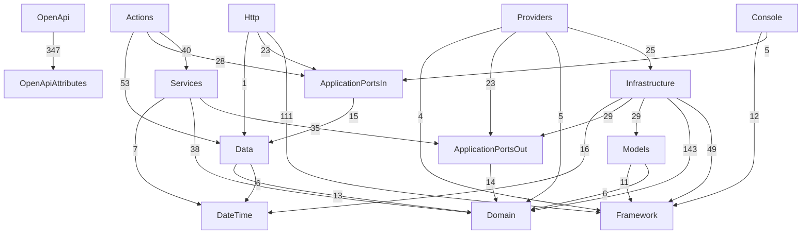

# Baseline Visual de Dependencias de Camada

Este documento registra o baseline visual atual das dependencias entre camadas, gerado a partir de `deptrac.yaml`.
Use durante revisao de PR para identificar mudancas estruturais com impacto arquitetural.

## Quando usar

1. Revisar PR com alteracao de fluxo entre `Http`, `Actions`, `Services`, `Domain`, `Ports` e `Infrastructure`.
2. Comparar estado arquitetural atual contra baseline anterior.
3. Validar se alteracoes exigem ajuste de `deptrac.yaml` e/ou regras em `tests/Unit/Architecture`.

## Diagrama Mermaid (baseline atual)



## Artefatos gerados

1. `docs/diagrams/deptrac-layers.mmd`
2. `docs/diagrams/deptrac-layers.dot`

## Como regenerar

```bash
composer run architecture:diagram
```

## Relacao com outros documentos

1. Regras arquiteturais e guardrails: [`ARCHITECTURE_GUIDELINES.md`](ARCHITECTURE_GUIDELINES.md)
2. Arquitetura executavel e fluxos: [`ARCHITECTURE.md`](ARCHITECTURE.md)
3. Hub de docs: [`README.md`](README.md)
